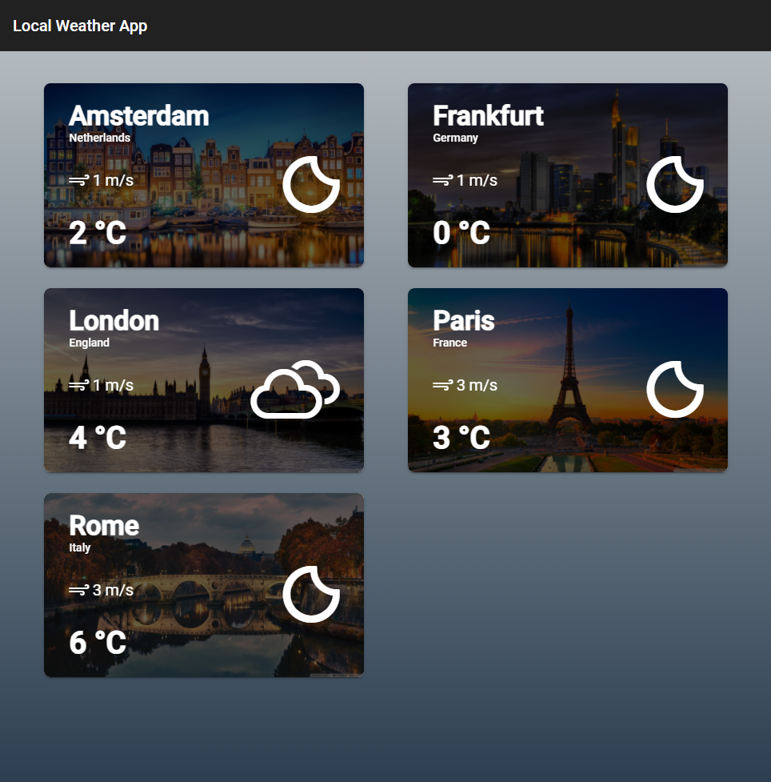
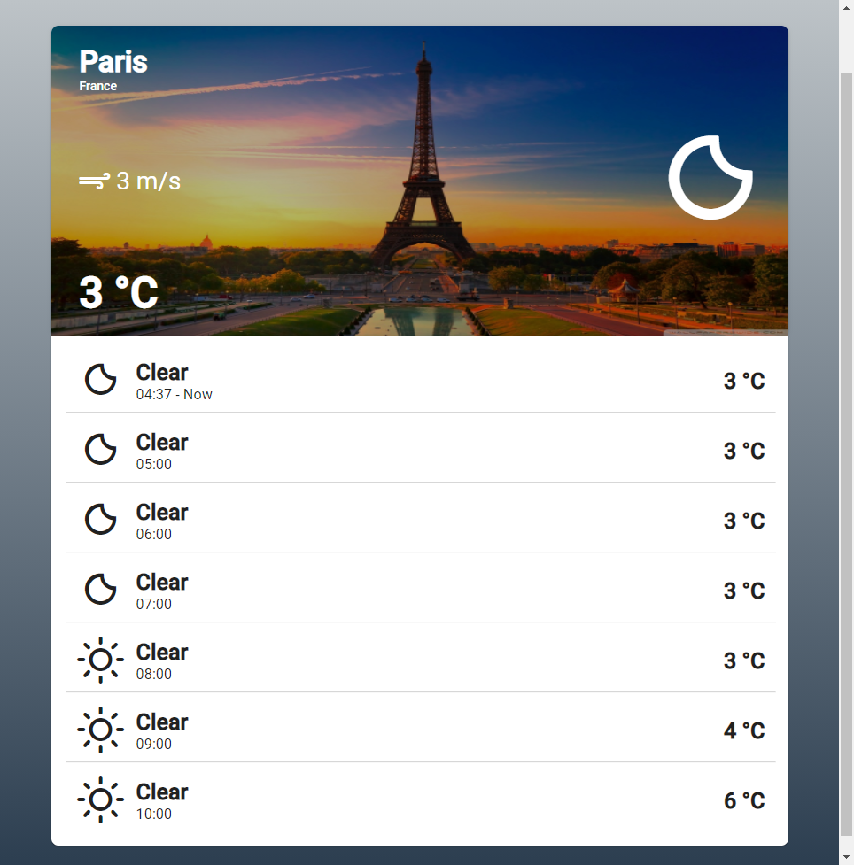

# Angular with NGRX - Weather Forecast

Weather forecast example using Angular 16, NGRX, Angular Material and OpenWeather API.

## Project Setup

#### Start the app

- Clone the Project - `https://github.com/bytebruno/angular-ngrx-weather-app.git`
- Install the dependencies - `npm install`
- Start the web app - `npm start`
- The application will be running on `http://localhost:4200`

#### Run tests

- Run unit tests - `ng test`

## Technologies

- [Angular 16](https://angular.io/)
- [NgRx](https://ngrx.io/)
- [Angular Material](https://material.angular.io/)
- [OpenWeather API](https://openweathermap.org/api)

##### For more details, please see [README-DEV](https://github.com/bytebruno/angular-ngrx-weather-app/blob/master/README-DEV.md)

## Screenshots

### Cities list

### City detail

